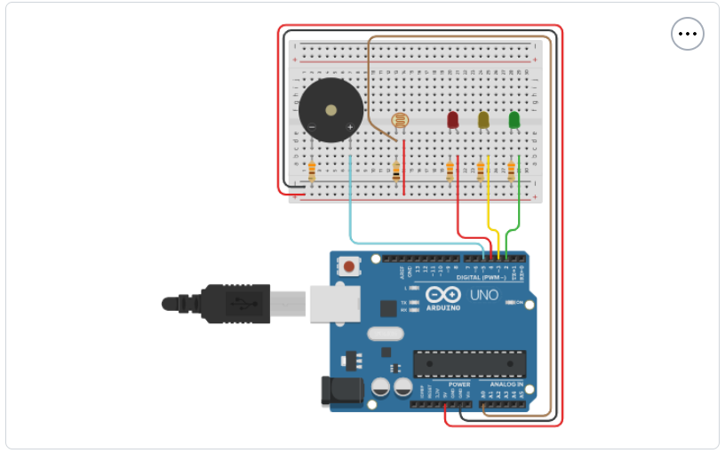

# 🍷 Projeto: Sistema de Monitoramento de Luminosidade - Vinheria Agnello

## 📌 Descrição

Este projeto tem como objetivo monitorar a luminosidade no ambiente de armazenagem de vinhos da Vinheria Agnello, garantindo que os níveis de luz estejam adequados para manter a qualidade dos vinhos.

A solução foi desenvolvida utilizando um sensor LDR conectado a um Arduino, que ativa LEDs de status e um alarme sonoro (buzzer) conforme a intensidade da luz no ambiente.

---

## ⚙️ Componentes Utilizados

- 1x Arduino UNO (ou similar)
- 1x Sensor LDR (resistor dependente de luz)
- 1x Resistor de 10kΩ (pull-down para o LDR)
- 1x LED Verde (status OK)
- 1x LED Amarelo (alerta)
- 1x LED Vermelho (luz crítica)
- 1x Buzzer (alarme sonoro)
- Jumpers e Protoboard

---

## 📐 Circuito

> O sensor LDR é ligado ao pino A0 do Arduino, com resistor de 10kΩ ligado ao GND para formar um divisor de tensão.
> Os LEDs e o buzzer são ligados aos pinos digitais (veja o código).

### Esquema de Ligação:
| Componente     | Pino Arduino |
|----------------|--------------|
| LDR            | A0           |
| LED Verde      | 2            |
| LED Amarelo    | 3            |
| LED Vermelho   | 4            |
| Buzzer         | 5            |

---

## 🧠 Lógica de Funcionamento

1. O Arduino lê continuamente o valor da luminosidade (0 a 1023).
2. De acordo com a intensidade de luz:
   - **< 920** → LED verde acende (luz ideal).
   - **920 a 950** → LED amarelo + buzzer por 3 segundos (alerta).
   - **≥ 950** → LED vermelho + buzzer contínuo (crítico).

---

## 💻 Código

> O código está disponível no arquivo `monitoramento_luminosidade.ino`.  
> Comentários explicativos estão incluídos em cada trecho do código para facilitar a compreensão.
-- [Projeto no Tinkercad](https://www.tinkercad.com/things/iJeQ5Kf2WLZ-projeto-vinheria-agnello-monitoramento-de-luminosidade?sharecode=4Y4KSU1p4C9rEcj6dODHFztzy4WUz27XdVN2U-gBZsY)

---

## 📹 Demonstração

📽️ [Link para vídeo explicativo do projeto no YouTube ou Google Drive](https://youtu.be/OkLkFdUQTN8)

---

## 🛠️ Como Reproduzir

1. Monte o circuito conforme o esquema.
2. Conecte o Arduino ao computador.
3. Faça o upload do código para o Arduino usando a IDE.
4. Abra o **Monitor Serial** para acompanhar os valores da luminosidade.
5. Faça testes com diferentes intensidades de luz.

---

## 🧪 Testes Realizados

- Teste com ambiente escuro (LED verde ativo).
- Simulação com lanterna (LED amarelo e buzzer intermitente).
- Iluminação direta (LED vermelho + buzzer contínuo).

---

## 👨‍💻 Autores

- **Seisho Sérgio De Laia Yagi | RM: 562515 | [GitHub](https://github.com/sergioyagi)**
- **Caio Marques Lins | RM: 559805 | [GitHub](https://github.com/loffcm)**
- **Murilo Gonzalez Bez Chleba | RM: 556199 | [GitHub](https://github.com/MuriloBezChleba)**
- **Pedro Alves Simão | RM: 564065 | [GitHub](https://github.com/Pedro-Simao-Maker)**
- **Bernardo Lozório Gomes Y Gomes | RM: 564943 [GitHub](https://github.com/bernard0g)**

---

